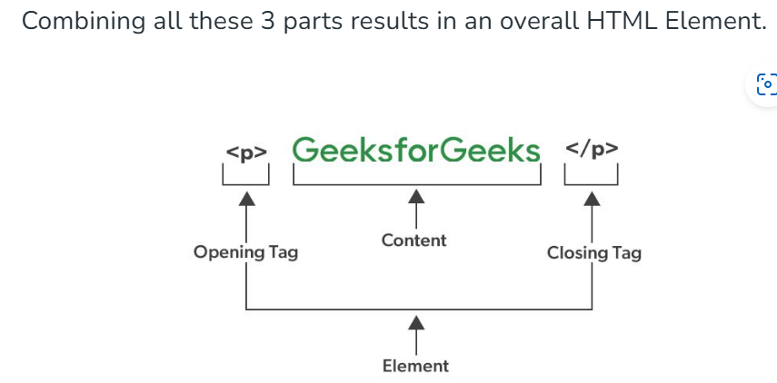

## HTML Headings

* The HTML heading tags are used to create headings for the content of a webpage. These tags are typically placed inside the body tag. HTML offers six heading tags, from **h1** to **h6** , each displaying the heading in a different font size.
  
  ```HTML
  <!DOCTYPE html>
    <html lang="en">

    <head>
    <meta charset="UTF-8">    
      <title>
        HTML heading tag
        </title>
    </head>

    <body>
      <h1>Heading 1 (h1)</h1>
      <h2>Heading 2 (h2)</h2>
      <h3>Heading 3 (h3)</h3>
      <h4>Heading 4 (h4)</h4>
      <h5>Heading 5 (h5)</h5>
      <h6>Heading 6 (h6)</h6>
    </body>

    </html>
  ```

## HTML Paragraph and Break Elements
* HTML ```<p>``` tags are used to write paragraph statements on a webpage. * They start with the ```<p>``` tag and end with ```</p>```. 
* The HTML ```<br>``` tag is used to insert a single line break and does not require a closing tag. In HTML, the break tag is written as ```<br>```.
  
  ```HTML
  <!DOCTYPE html>
    <html lang="en">

    <head>
    <meta charset="UTF-8">
    <meta name="viewport" 
          content="width=device-width, initial-scale=1.0">
      <title>
            Example of paragraph and break elements
      </title>
    </head>

    <body>
      <p>
            HTML stands for HyperText Markup Language.<br>
            It is used to design web pages using a markup
            language.<br>HTML is a combination of Hypertext
            and Markup language.<br>Hypertext defines the
            link between web pages.<br>A markup language
            is used to define the text document within the
            tag which defines the structure of web pages.
      </p>
    </body>

    </html>
  ```
  
  ## HTML Horizontal Line
* The HTML ```<hr>``` tag is used to divide a page into sections by creating a horizontal line that spans from the left to the right side of the page. This is an empty tag and does not require a closing tag or any additional attributes.


## HTML Images
The `````` tag is used to insert an image into a webpage. The source of the image is specified within the src attribute, like this: ``````.
```HTML
<body>
      
</body>
```

## HTML Elements
* An HTML Element is a collection of start and end tags with the content inserted between them.
* HTML elements are building blocks of web pages, representing different types of content such as headings, paragraphs, links, and images.



## HTML Attributes
* HTML attributes provide additional information about elements within an HTML document.
* Every HTML element can have attributes.
*  Attributes are always defined in the start tag.
*   They are specified using a name/value pair format, where the attribute name defines the property, and its value provides specific details, like name=”value”.
  
1. HTML Global Attributes
2. HTML src Attribute
3. HTML alt Attribute
4. HTML width and height Attribute
5. HTML id Attribute
6. HTML title Attribute
7. HTML href Attribute
8. HTML style Attribute
9. HTML class Attribute